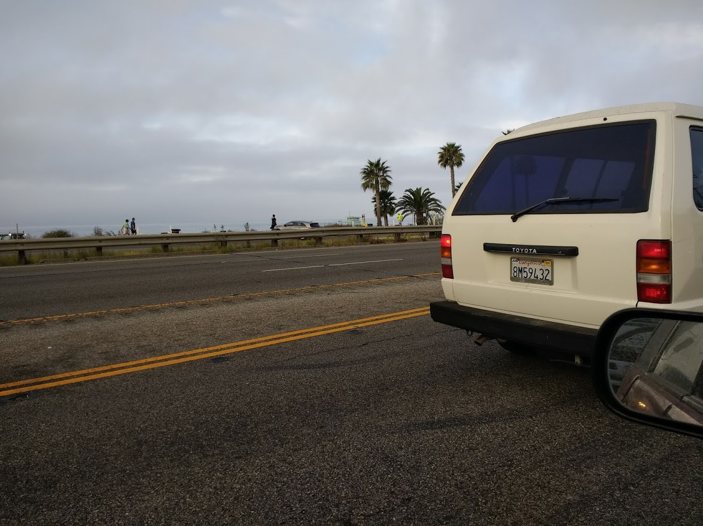

{: .align-center}

My grandfather, last of my four grandparents to go, passed away Monday, the day before the #iiw29 conference which I then attended  in Mountain View, California.  Today, processing both events, a brief prose poem occured to me while waiting for oil to ooze through my car's roadtrip-addled engine.

1. On the day someone's parent dies, they think about how much they have been turning into their parents lately and barring a catastrophe they generally decide to let themselves turn in a few increments more, such that their parent can stay a little more in the world.
2. Earlier today, three motorcyclists passed close by me on the highway wearing matching jackets with a patch identifying them to an African-American motorcycle club whose motto was, "we all we got."
3. At the software conference, people were surprised to hear that many smalltalking motorcyclists have told me they moved to California specifically because its the only state that allows them to "weave between lanes", as non-motorcyclists call lane-splitting.
4. The day your last grandparent dies is commonly the same day on which you first notice you are definitively and unwitting becoming your parents.
